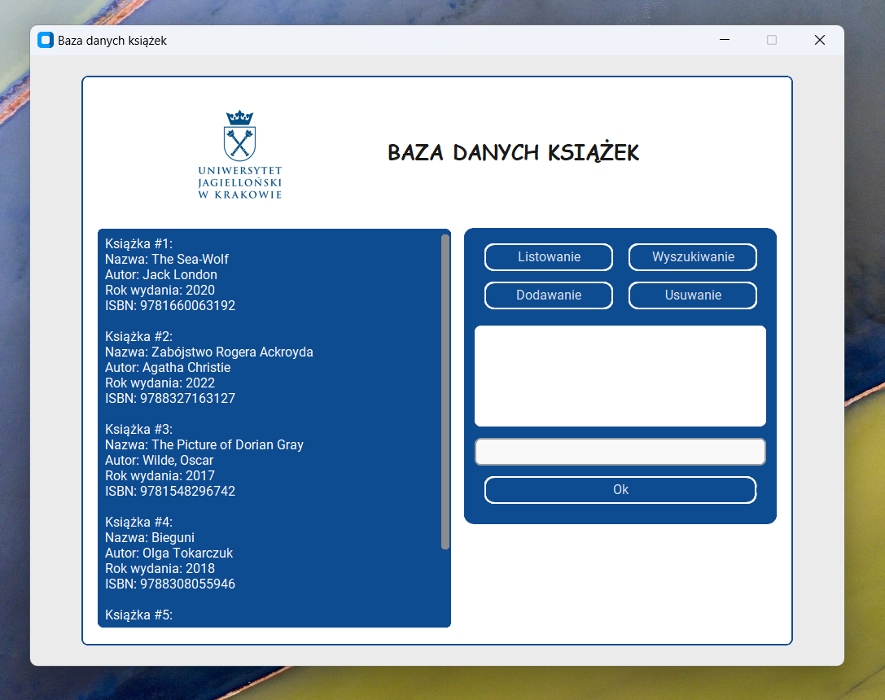

# Baza danych książek
> Tair Yerniyazov  
> Kraków, styczeń 2023 r.  

## Opis
#### Wersja własna (JSON/Python)
> Własna implementacja bazy danych korzysta tylko z biblioteki
> umożliwiającej pracę z plikami formatu JSON. Implementacja ta oczywiście
> nie jest zbyt wydajna, gdyż ładuje cały plik podczas wykonywania operacji,
> po czym aktualizuje jego zawartość przez przepisywanie pliku. Zaletą jednak
> jest to, że struktura samego pliku jest bardzo prosta i może być przeczytana
> na dowolnym komputerze (nie wymaga instalacji dodatkowych bibliotek).
> Implementacja własna posiada dwie wersji: pierwsza uruchamia się w konsoli
> i nie posiada GUI, ale działa szybko nawet dla dużej ilości danych (np. 10 tys.
> książek). Druga wersja działa wolniej, ale posiada GUI zbudowany za pomocą
> rozszerzenia standardowej biblioteki Tkinter - CustomTkinter (open source).
> Żeby uruchomić program wystarczy mieć zainstalowany CustomTkinter (pip install
> customtkinter) oraz Pillow (pip install pillow) lub ewentualnie otwierać plik za pomocą skryptu środowiska
> wirtualnego, w którym wszystko już jest przygotowane. Okienko programu zmienia
> swój wygląd w zależności od tego, czy w systemie operacyjnym w trakcie działania
> programu włączony jest tryb ciemny (Dark Mode) czy jasny.

#### Wersja SQLite:
> Wersja SQLite korzysta z biblioteki sqlite3, które pozwala na korzystanie z
> systemu zarządzania bazami danych SQLite. System ten jest przydatny do właśnie
> projektów, które nie korzystają ze zdalnych serwerów, przechowująć wszystkie dane
> lokalnie. SQLite tworzy plik bazodaniowy (.db), które posiada porządną strukturę,
> dzięki czemu możemy w pełni wykorzystać wydajność i szybkość SQL podczas 
> wykonowania operacji. Dodałem do listy wymaganych operacji możliwość eksportu danych 
> z bazy do pliku JSON. Wersja SQLite posiada obsługę błędów (czy książka już jest
> na liście, czy zamiast roku wydania nie wpowadzono przypadkiem litery itd).

#### Jak działają programy:
> Wystarczy uruchomić programy, żeby zrozumieć funkcjonalność:
>  Operacja dodawania
>  Operacja usuwania
>  Operacja listowania
>  Operacja wyszukiwania

## Plany na przyszłość

#### Wersja własna (JSON/Python)
> 1. Dodać obsługę wszelkich możliwych sytuacji wprowadzenia niepoprawnych danych
> (np. ISBN musi zawierać dokładnie 13 cyfr, książki nie mogą się powtarzać)
> 2. Poprawić GUI, by zmieniał rozmiar w zależności od urządzenia, na którym program
> się uruchamia.
> 3. Zaimplementować algorytm automatycznej instalacji programu razem ze wszystkimi
> potrzebnymi bibliotekami (customTkinter, Pillow), które razem z samym programem
> uruchomiane będą domyślnie przez interpreter środowiska wirtualnego.

#### Wersja SQLite:
> 1. Zmodyfikować program, by wczytywał dane korzystając z "DB-API’s parameter 
> substitution". Wtedy program nie będzie wrażliwy na "SQL injection attacks".
> 2. Stworzyć interfejs graficzny (GUI - np. customTkinter).
> 3. Dodać możliwość tworzenie nowych kolekscji książek (tabel).
> 4. Dodać możliwość odczytu danych z już istniejącego pliku JSON.

#### Uruchomienie:
> Przetestowane na Windows (venv). Wymagana jest instalacja bibliotek PIL i CustomTkinter.

  

  
